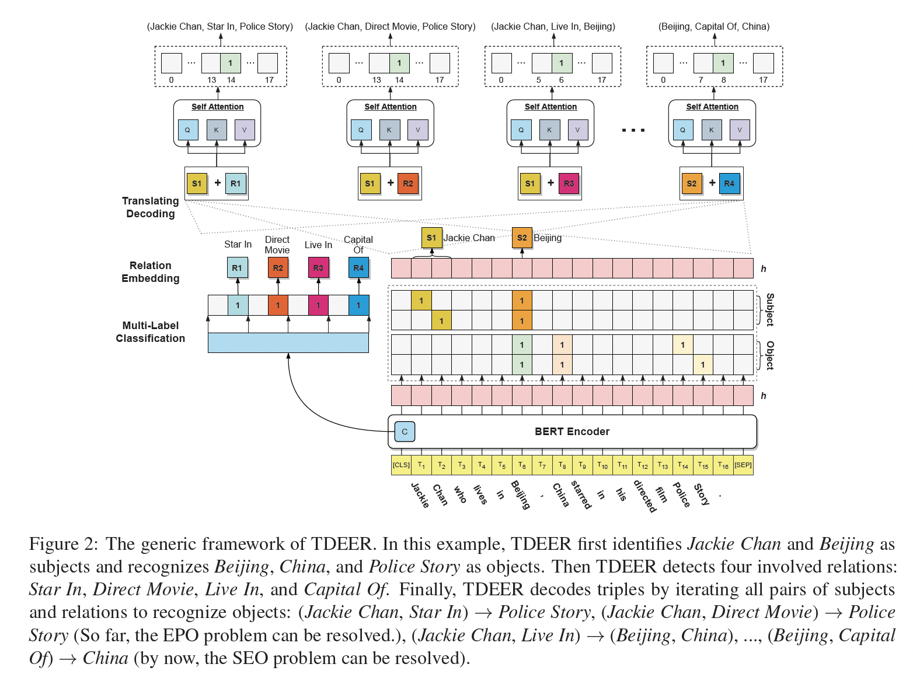

[](https://paperswithcode.com/sota/joint-entity-and-relation-extraction-on-nyt?p=tdeer-an-efficient-translating-decoding)
[](https://paperswithcode.com/sota/joint-entity-and-relation-extraction-on-1?p=tdeer-an-efficient-translating-decoding)
[](https://paperswithcode.com/sota/relation-extraction-on-nyt?p=tdeer-an-efficient-translating-decoding)
[](https://paperswithcode.com/sota/relation-extraction-on-webnlg?p=tdeer-an-efficient-translating-decoding)


# TDEER 🦌

Official Code For [TDEER: An Efficient Translating Decoding Schema for Joint Extraction of Entities and Relations](https://aclanthology.org/2021.emnlp-main.635/) (EMNLP2021)

## Overview

TDEER is an efficient model for joint extraction of entities and relations. Unlike the common decoding approach that predicts the relation between subject and object, we adopt the proposed translating decoding schema: subject + relation -> objects, to decode triples. By the proposed translating decoding schema, TDEER can handle the overlapping triple problem effectively and efficiently. The following figure is an illustration of our models.



## Reproduction Steps

### 1. Environment


We conducted experiments under python3.7 and used GPUs device to accelerate computing. 

You should first prepare the tensorflow version in terms of your GPU environment. For tensorflow version, we recommend `tensorflow-gpu==1.15.0`.

Then, you can install the other required dependencies by the following script.

```bash
pip install -r requirements.txt
```


### 2. Prepare Data

We follow [weizhepei/CasRel](https://github.com/weizhepei/CasRel) to prepare datas.

For convenience, we have uploaded our processed data in this repository via git-lfs. To use the processed data, you could download the data and decompress it (`data.zip`) into the `data` folder.


### 3. Download Pretrained BERT


Click 👉[BERT-Base-Cased](https://storage.googleapis.com/bert_models/2018_10_18/cased_L-12_H-768_A-12.zip) to download the pretrained model and then decompress to `pretrained-bert` folder.


### 4. Train & Eval

we have already refactor this code to pytorch version, you could download the pretrain model directly from [huggingface](https://huggingface.co/bert-base-cased/tree/main).


if you want to fast vaild the code 

please excuete the following command:

#### for training

```bash

python run.py --do_train --model_name NYT_quick_test --rel_path data/data/NYT/rel2id.json --train_path data/data/NYT/train_triples.json --dev_path data/data/NYT/test_triples.json --bert_model bert-base-cased --save_path ckpts/nyt_quick_test.model --learning_rate 0.00005 --neg_samples 2 --epoch 5 --batch_size 32 --max_len 120 --max_sample_triples 100 --eval_steps 100 --num_workers 4 --use_amp --subset_size 1000
```

#### for testing

```bash
python run.py --do_test --model_name NYT_full_test --rel_path data/data/NYT/rel2id.json --test_path data/data/NYT/test_triples.json --bert_model bert-base-cased --ckpt_path ckpts/nyt_full_train.model --batch_size 32 --max_len 120
```

In our setting, NYT, WebNLG, and NYT11-HRL achieve the best result on Epoch 86, 174, and 23 respectively.

1\. NYT

<details>
<summary>click to show the result screenshot.</summary>


</details>

2\. WebNLG

<details>
<summary>click to show the result screenshot.</summary>


</details>


3\. NYT11-HRL

<details>
<summary>click to show the result screenshot.</summary>


</details>

## Citation

If you use our code in your research, please cite our work:


```bibtex
@inproceedings{li-etal-2021-tdeer,
    title = "{TDEER}: An Efficient Translating Decoding Schema for Joint Extraction of Entities and Relations",
    author = "Li, Xianming  and
      Luo, Xiaotian  and
      Dong, Chenghao  and
      Yang, Daichuan  and
      Luan, Beidi  and
      He, Zhen",
    booktitle = "Proceedings of the 2021 Conference on Empirical Methods in Natural Language Processing",
    month = nov,
    year = "2021",
    address = "Online and Punta Cana, Dominican Republic",
    publisher = "Association for Computational Linguistics",
    url = "https://aclanthology.org/2021.emnlp-main.635",
    pages = "8055--8064",
}

```

## Acknowledgement

Some of our codes are inspired by [weizhepei/CasRel](https://github.com/weizhepei/CasRel). Thanks for their excellent work.


## Contact

If you have any questions about the paper or code, you can

1) create an issue in this repo;
2) feel free to contact 1st author at niming.lxm@alipay.com / xmlee97@gmail.com, I will reply ASAP.
